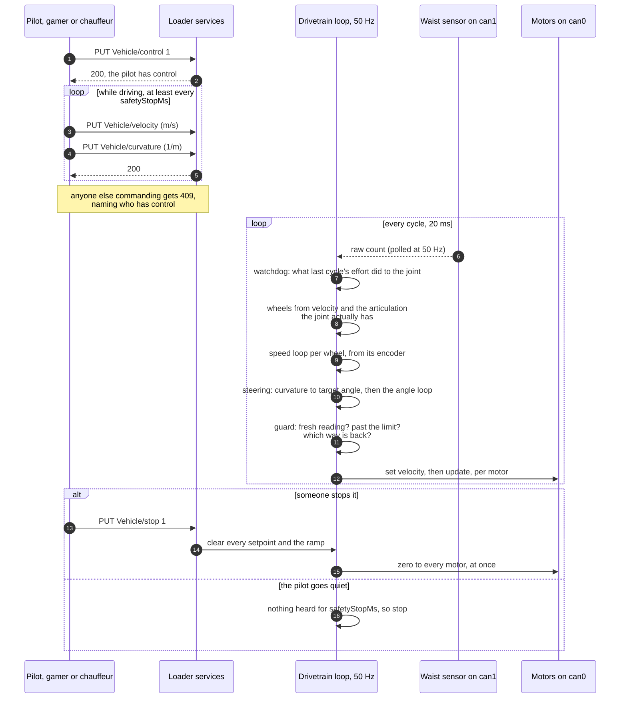

# loader

The vehicle. Drives the motors of an articulated mini wheel loader over CAN,
reads its encoders and its articulation sensor, and turns a pilot's two numbers
— a velocity and a curvature — into four wheel speeds and a steering angle.

It owns everything about the machine: node IDs, the motor controller's scale,
how often the drives must be spoken to, **the geometry, the kinematics, the
sensor calibration and the steering limits**. A pilot (the gamer, a chauffeur)
knows none of it. That is the point: move the loader to another machine by
changing its configuration, and the pilots above it do not change.

> **There is no hard stop and no limit switch on the waist.** The waist motor
> turns the joint through a bicycle chain, and past about 40° either way it
> drives the joint into itself until something breaks. The only limit is the
> one in this system — read [the steering guard](#the-steering-guard) before
> the first run, and calibrate before steering far.

## Conventions

**ISO 8855** (the same as ROS REP-103): x forward, y to the left, z up. A
positive curvature, a positive articulation and a positive steering effort all
mean **to the left**. The articulation sensor's own sense — its count falls to
the left — is a calibration fact and stops at the calibration.

The **reference point** is the center of the front axle: the velocity is that
point's speed, the curvature is the curvature of that point's path. The
cartographer's pose is the scanner's, which with the scanner mounted over the
front axle is the same point.

## Assets and services

| asset | what it is |
|---|---|
| `Vehicle` | who drives, and what the vehicle as a whole is told and measured to do |
| `FrontLeft` `FrontRight` `BackLeft` `BackRight` | the wheel motors, nodes 1–4 |
| `Steering` | the waist motor, node 5 |

| service | on | what it is |
|---|---|---|
| `control` | `Vehicle` | **PUT** `1` to take control, `0` to release it; **GET** `1` if you have it |
| `stop` | `Vehicle` | **PUT** `1` to stop the vehicle, whoever is driving; **GET** `1` while stopped |
| `velocity` | `Vehicle` | m/s of the front axle, negative in reverse — **PUT** needs control |
| `curvature` | `Vehicle` | 1/m, positive left — **PUT** needs control and a calibrated waist |
| `articulation` | `Vehicle` | the waist's measured angle in degrees, positive left; `503` until calibrated |
| `speedLimit` | `Vehicle` | the largest velocity accepted |
| `curvatureLimit` | `Vehicle` | the tightest curvature the steering limit allows |
| `setpoint` | each motor | **GET** what the motor is commanded to; **PUT** commands it directly: RPM for a wheel, percent of effort (positive left) for the steering |
| `speed` | the wheels | RPM measured by the wheel's encoder |
| `travel` | the wheels | revolutions rolled since the loader started |
| `distance` | the wheels | meters rolled since the loader started |
| `waist` | `Steering` | the articulation sensor's raw count, for calibrating it |

`speed`, `travel`, `distance`, `waist` and `articulation` can be followed rather
than polled; every reading is published, with a one-second heartbeat when
nothing changes, and stamped with when it arrived — so a follower can tell a
wheel at rest from an encoder that has gone quiet. `travel` and `distance` never
wrap: the encoders' 24-bit counters are unwrapped here.

`setpoint` and `speed` are different numbers, and the difference is the point:
a stalled motor, a slipping wheel and a working one all report the same
setpoint. Only `speed` says what happened.

## How a command reaches a motor



## The steering guard

Every cycle, before any effort reaches the waist motor:

- **No fresh reading from the waist sensor, no steering.** "Fresh" is
  `staleMs`, 200 ms by default — much shorter than for anything else, because
  it is what the limit stands on.
- **Past the limit, only effort back towards straight is allowed.** The limit is
  `limitDegrees` (35°) once calibrated; before that, `uncalibratedWindowCounts`
  (40 counts) either side of `straightCount` — a few degrees, or up to about
  15°, depending on the scale nobody has measured yet.
- **Once at the limit, effort outward waits until the joint is back inside by
  `limitMarginDegrees`** (2°; 5 counts before calibration). A joint resting on
  the limit wanders a count either way — the chain's slack, the tyres, the
  sensor — and without the margin every count inside was a fresh push outward.
- **Until `effortTurnsLeft` is set, nothing is allowed past the limit at all**,
  because which way is back is not known.
- A refused effort stops the motor **at once**, skipping the ramp: the ramp's
  worth of travel is what the limit is there to prevent.
- **A watchdog** compares effort and movement. Effort of `stallEffortPercent`
  or more for `stallMs` with the joint not moving is a jumped or broken chain or
  a stalled motor; effort one way with the joint moving the other means
  `effortTurnsLeft` or the calibration is wrong — and with it the limit. Either
  **stops the vehicle** and says which in the log. The fault stands until
  someone takes control again, which is their decision that the machine is fit
  to drive. Steering hard with the vehicle standing still may trip it, because
  the tires resist; that is the safe way to be wrong.

## Who drives

**One system drives at a time, and it has to take control first** — the rules of
two pilots sharing an aircraft:

- `PUT control 1` takes control; `PUT control 0` gives it up. Commands from
  anyone else are refused with `409`, and the body says who has control.
- **The vehicle starts stopped.** After power-up only a system with priority —
  by default `gamer`, a person — can take control. Handing the vehicle to
  software is done by taking control and then releasing it.
- A system with priority can take control from anyone, at any time.
- **Anyone can stop the vehicle**, whoever is driving: `PUT stop 1`. The motors
  go to zero at once. A stop takes control away from everyone, and **only a
  system with priority can take it back**, so a stop is never undone by the
  software it stopped. Writing `0` to `stop` is refused.
- **If the system in control says nothing for `safetyStopMs` (500 ms), that is a
  stop**, not a handover.
- Taking or releasing control clears every command. The new pilot starts from
  rest, and the steering stays where it is — with nobody in control, nothing
  moves.

Refusals of this kind are `409`, not `403`: the caller's credentials are fine,
it is the vehicle's state that says no, and this framework reads `403` as a
reason to fetch a new token. A curvature the waist cannot yet follow is `503`,
because it is not about who is driving.

**Who is who comes from the caller's certificate.** In a cloud with an
authorizer every request carries one. On a bench with no certificates at all,
nobody can be told apart, so every caller counts as the same pilot with
priority — `curl` can take control, and control protects nothing; the loader
says so. A loader that *does* hold a certificate lets a caller without one stop
the vehicle and do nothing else.

## Calibrating

In this order. The loader logs what it believes about its waist at start-up —
counts per degree, where the limits fall, the tightest turn — so read that
after every change.

1. **Straight.** With the joint straight, read `Steering/waist`. Put the count in
   `waist.straightCount` (about 450).
2. **Which way the motor turns.** Take control with the gamer and steer gently
   to the left. Before calibration the guard stops the waist 40 counts either
   side of straight, so this is safe. If the vehicle bent to the left, set
   `waist.effortTurnsLeft` to `1`; to the right, `-1`. The loader also logs
   which way the count moved and suggests the value. Restart.
3. **A first angle, at the edge of the window.** Steer left until the guard holds
   the waist. Measure the angle between the two halves' center lines, read the
   count, and set `calibrationCount` and `calibrationDegrees` (positive: it is
   to the left). **Set `limitDegrees` to 20 for now**: a small angle measured to
   a degree is a scale known to a few tens of percent, and 35° could really be
   near 40°. Restart. The limit is now in degrees.
4. **A second angle, further out.** Steer to near the 20° limit, measure, read,
   and replace the first point with this one: the wider the angle, the smaller
   the error of the protractor. Put `limitDegrees` back to 35. Check that the
   right-hand side gives the same counts per degree. Expect **at most about 11
   counts per degree** — with straight at 450, 40° cannot be more than 450
   counts away; the loader warns if it is.
5. **The wheels.** Off the blocks, drive straight along a measured 40 m and read
   `travel` on the front wheels before and after. The circumference is 40 ÷ the
   revolutions; put it in `geometry.wheelCircumferenceMetres`. The 1.335 m in
   the configuration was measured unloaded; the loaded figure will be smaller.
   This is the only place the wheel size lives.
6. **The waist's breakaway.** On blocks, with control, `PUT Steering/setpoint`
   in steps of 2 % while following `Steering/waist`, until the count moves. Put
   a little less than that in `waist.minEffortPercent`. The angle loop never
   asks for less outside its deadband, so the last few degrees to a target are
   not left to an effort too small to turn the chain.

## Driving

**By velocity and curvature**, which is how a pilot drives:

```bash
H=http://<host>:20197/loader/Vehicle
put() { curl -s -X PUT "$H/$1" -H "Content-Type: application/json" \
             -d "{\"value\": $2, \"version\": \"SignalA_v1.0\"}"; }

put control 1

# half a meter a second on a 3 m radius to the left, for ten seconds
end=$((SECONDS+10))
while [ $SECONDS -lt $end ]; do
  put velocity 0.5 >/dev/null
  put curvature 0.333 >/dev/null
  sleep 0.2
done

put stop 1
```

The wheel speeds come from the kinematics and the articulation the joint
**actually has**, not the one it was asked for, so the wheels agree with the
machine while the joint is still swinging. At full lock the inner wheels run at
0.69 of the outer. If a curve would need a wheel faster than `maxWheelRPM`, all
four slow down together and the curve is kept.

**A motor directly**, for the bench: `PUT FrontLeft/setpoint` in RPM, or
`PUT Steering/setpoint` in percent of effort. A direct setpoint takes that motor
out of the vehicle-level command until the next one.

**Keep commanding.** One command lasts `safetyStopMs`; after half a second of
silence the vehicle stops. That is also what makes a maneuver abortable.

### `"version"` is the wire version, not the Go type name

It must be **`SignalA_v1.0`**, not `SignalA_v1a`. The service advertises
`"Forms": ["SignalA_v1a"]` — the *type* name; the payload carries the *form
version*. Get it wrong and the request is refused with `400`, and the loader's
log says `unsupported form version: SignalA_v1a`. When a command does nothing,
read the loader's log first.

## The ramp

Commands are rate limited towards the request, `accelStep` per cycle speeding up
and `brakeStep` slowing down: 150 and 500 counts at 50 Hz, as `can_dds` runs.
One RPM is 256 counts.

| target | time to reach it |
|---|---|
| 10 RPM | 0.3 s |
| 20 RPM | 0.7 s |
| 120 RPM | 4.1 s |
| brake to zero from 120 RPM | 1.2 s (a `stop` is immediate) |

Before 16 September 2026 the defaults were 30 / 100 at 20 Hz — the
`MotorController` constructor's defaults rather than what `can_dds` passes it —
which took **15 s to stop** from full speed.

At the measured circumference, 1 km/h is 12.5 RPM and 1 m/s is 45 RPM.

**The steering has its own ramp**, `waist.rampPercentPerSecond`: 500 % a second
by default, so 0 to 50 % effort takes 0.1 s. Until 30 September 2026 the waist
motor shared the wheels' ramp. That is 24 % effort a second, so a turn asked
for from straight took 2 s to reach full effort. The motor also stayed below
the effort that moves the joint for most of a second, which felt like the
steering answering the stick a second late.

**Steering by curvature, the angle loop lets go and turns at once.** When the
loop reaches its target, or turns to correct an overshoot, the effort it was
applying stops at once and does not run down the ramp. Only the build-up in
the new direction is ramped. Until 1 October 2026 a reversal went down the
ramp, and at 100 % a second the motor kept pushing the old way for up to half
a second. Every overshoot correction also got the full take-up push. Together
they made the waist swing about its target, wider the longer it went on.
Three more rules keep it settled:

- **Hysteresis.** Once inside its deadband, the loop starts again only at
  twice the deadband, so a count of sensor noise is not a kick.
- **The take-up is for real moves.** It boosts only a move of
  `takeUpMinErrorDegrees` (2°) or more.
- **The loop aims inside the limit.** The target is never past
  `limitDegrees − limitMarginDegrees`, so at full stick the guard never cuts
  the loop off. `curvatureLimit`, and the tightest turn in the start-up log,
  are for that angle. Set the gamer's `maxCurvature` to it.

Driven by `velocity`, the ramp applies to each wheel's **target speed**, at the
same rate, and the [speed loop](#holding-speed-on-a-slope) follows the target.
The loop's correction is not ramped a second time, so it can push hard as soon
as the vehicle meets a slope.

## Holding speed on a slope

**The drives do not hold a speed.** Operating mode 3 runs each drive with no loop
of its own, and `0x77` sets a motor command, which is a share of the voltage, not
a velocity. 256 counts per RPM only assumes that full voltage turns a wheel at
120 RPM. That holds on the flat. Uphill the load holds the wheels back, and
downhill the slope pushes them on, so until 1 October 2026 the same stick drove
the loader at three speeds. The drives cannot close the loop themselves: the
wheel encoders are nodes on the bus, not wired to them.

So the loader closes it. While a pilot drives by `velocity`, each wheel's
command is its target plus a correction from its own encoder:

    command = target + proportionalGain·error + integralGainPerSecond·∫error dt

The error is the target minus the speed measured from the encoder's position,
frame to frame (every 50 ms). The integral is the part that learns the slope.
It stops growing once the motor is at full scale or the correction at
`maxCorrectionRPM`, so the vehicle does not lunge when a hill ends. Downhill
the correction goes negative and the motors hold the vehicle back. With the
stick centred, a pilot in control holds the wheels at zero, so the loader does
not roll away on a slope. A stop, silence or a handover still zero everything
at once.

- **A wheel whose encoder goes quiet is driven open loop**, as before the loop,
  and the loader logs it. A dead encoder must not read as a stalled wheel to
  push ever harder on.
- **A motor commanded directly** (`PUT FrontLeft/setpoint`) is open loop, so bench
  measurements keep their meaning.
- **`speedLoop.openLoop: true` turns the loop off**, and the vehicle drives exactly
  as it did before.

**Tuning**, on blocks first and then on a slope. The gains are first guesses.
Follow `speed` on each wheel at a steady stick. Raise `integralGainPerSecond`
until a slope's error is gone within about a second, and lower it if the speed
swings. Then raise `proportionalGain` for a stiffer answer to a sudden load.
Restart after each change.

## Standing still on a hill

**With the stick centred and control kept, the loader holds the vehicle where
it is.** The gamer goes on sending a velocity of zero, and the speed loop holds
every wheel at 0 RPM. On a slope that means the motors push against it, at
stall, for as long as the vehicle stands there. That is heat, and on a steep
slope it is what the drives' current limit eventually cuts off. After 30 s of
holding at 40 % or more the loader says so in its log, once. It does not let
go: on a hill, letting go is the dangerous direction.

**If the drivetrain holds the vehicle by itself, the motors need not.** Set
`speedLoop.holdRelaxAfterSeconds`, for example to 3, and after that long
standing still the loader:

1. eases the wheels' effort to zero over half a second, and keeps what the loop
   has learned;
2. watches the encoders. If any wheel rolls `creepMetres` (2 cm), the loop
   catches it at once, starting from the effort it had learned, and holds
   actively again;
3. counts the catches. `maxCatches` (3) of them within a minute mean this slope
   needs holding, and the loader holds actively for as long as the vehicle
   stands there.

With an encoder quiet a creep cannot be seen, so the loader never rests then.
It is **off by default**, until you have seen that this vehicle stays put on a
slope with its motors off. Find that out with `holdtest.py 10 5 60 stop`, on the
steepest slope you drive, with someone ready to catch it: it drives up, holds,
then stops the vehicle and shows whether it rolls back.

A stop, silence, a handover or a fault still sets every motor to zero at once.
Holding does not survive a stop, and how the vehicle should stop on a hill is a
question of its own.

Driving off again starts from the effort the hold had learned, so the vehicle
does not roll back first when it sets off uphill.

## When a wheel does not turn

**A wheel asked to move, driven at `wheelStallPercent` (40 %) or more, that its
encoder says is not turning (under 2 RPM) for `wheelStallMs` (2 s), stops the
vehicle.** The log names the wheel, and taking control again clears the fault.
On 1 October 2026, on a slope, full stick drove all four wheels at full scale
into a stall until the drives cut out hot, and the stick went on asking: nothing
watched the wheels as the steering's watchdog watches the waist.

It judges what the wheel was sent, whatever drives it: the speed loop, open
loop, or a setpoint on the bench. Holding still on a hill is a target of zero
and never counts. A stale encoder says nothing either way.

## The lowest speed that turns a wheel

Reported from the bench, 8 September 2026: 20 RPM turns the wheels, 10 RPM does
not — measured under the old slow ramp, so worth repeating. It matters more now:
at full lock and 0.5 m/s the inner wheels are asked for about 18 RPM, near that
threshold, and a stalled inner wheel makes the machine push rather than steer.
Measure it with `speed`, which reports near zero for a wheel commanded but not
turning: walk a setpoint down from 20 in steps of 1, five seconds each.

## Configuration

Generated on the first run.

| field | default | |
|---|---|---|
| `canInterface` / `canSensorInterface` | `can0` / `can1` | motors and encoders at 500 kbit/s; the waist sensor alone at 250 |
| `waistPollHz` | 50 | the sensor answers only when polled; once a command cycle |
| `feedbackStaleMs` | 500 | how old an encoder reading may be and still count |
| `commandHz` | 50 | the drives treat a command older than 100 ms as stale |
| `safetyStopMs` | 500 | how long the pilot may be silent |
| `maxWheelRPM` | 120 | full scale, `0x7800` |
| `accelStep` / `brakeStep` | 150 / 500 | the wheels' ramp, per cycle |
| `priority` | `["gamer"]` | who may take control from anyone, and after a stop |
| `maxSpeedMetresPerSecond` | 1.5 | the velocity command's ceiling |
| `geometry.jointToFrontAxleMetres` / `jointToRearAxleMetres` | 0.6175 / 0.6175 | L1 and L2 |
| `geometry.trackMetres` | 0.6275 | |
| `geometry.wheelCircumferenceMetres` | 1.335 | calibrate: step 5 |
| `waist.straightCount` | 450 | calibrate: step 1 |
| `waist.effortTurnsLeft` | 0 | calibrate: step 2; `1`, `-1`, or `0` for not known |
| `waist.calibrationCount` / `calibrationDegrees` | 0 / 0 | calibrate: steps 3–4; degrees positive left |
| `waist.limitDegrees` | 35 | the software limit; the joint's travel is about ±40° |
| `waist.limitMarginDegrees` | 2 | how far back inside the limit the joint must come before it may be steered outward again |
| `waist.uncalibratedWindowCounts` | 40 | the limit before calibration, while a count's worth is unknown |
| `waist.staleMs` | 200 | how old a reading may be and still steer |
| `waist.gainPercentPerDegree` / `maxEffortPercent` / `deadbandDegrees` | 4 / 50 / 0.5 | the angle loop; not yet tuned on the vehicle |
| `waist.minEffortPercent` | 0 | the least effort the angle loop applies outside the deadband; calibrate: step 6 |
| `waist.rampPercentPerSecond` | 500 | the steering's ramp; see [the ramp](#the-ramp) |
| `waist.takeUpEffortPercent` / `takeUpCounts` / `takeUpMaxMs` | 0 / 4 / 300 | the push that crosses the chain's slack when the angle loop turns, until the joint has moved that many counts or that long has passed; 0 turns it off |
| `waist.takeUpMinErrorDegrees` | 2 | the smallest move the take-up boosts |
| `waist.stallEffortPercent` / `stallMs` / `stallCounts` | 30 / 1500 / 3 | the watchdog |
| `speedLoop.proportionalGain` / `integralGainPerSecond` | 0.3 / 1.0 | the wheels' speed loop; not yet tuned on the vehicle — see [holding speed on a slope](#holding-speed-on-a-slope) |
| `speedLoop.maxCorrectionRPM` | 60 | how far the loop may move a wheel's command from its target |
| `speedLoop.openLoop` | false | `true` drives the wheels without the loop, as before it |
| `speedLoop.holdRelaxAfterSeconds` | 0 | seconds standing still before resting on the drivetrain; 0 holds actively always — see [standing still on a hill](#standing-still-on-a-hill) |
| `speedLoop.creepMetres` / `maxCatches` | 0.02 / 3 | how far a resting vehicle may roll before it is caught, and how many catches in a minute mean holding for good |
| `wheelStallPercent` / `wheelStallMs` | 40 / 2000 | the wheels' watchdog — see [when a wheel does not turn](#when-a-wheel-does-not-turn) |
| `motors` | the five | each wheel with its `axle` and `side` |

A configuration written before 18 September 2026 lacks the vehicle services, the
geometry and the waist, and the loader refuses to start from it and says so:
delete `systemconfig.json` and start again. Keep a copy of your calibration
values first.

The buses must be up before the system starts:

```bash
sudo ip link set can0 up type can bitrate 500000
sudo ip link set can1 up type can bitrate 250000
```

**Do not run `can_dds` at the same time.** Two writers on `can0` is how a
vehicle ends up somewhere it was not sent.

## Moving it to another machine

The geometry and the waist calibration are configuration, and the kinematics
handle unequal half-lengths. What would not carry over as it is:

- **Front-wheel steering.** The pilot's interface would not change — velocity
  and curvature — but the kinematics would: Ackermann in place of the
  articulated model.
- **One traction drive.** A real wheel loader is usually hydrostatic, with one
  traction command and a differential per axle, not four motors. The wheel-speed
  arithmetic would collapse to one number.

## Not here yet

- **The joint's own rate.** While the joint is swinging, the two halves turn
  relative to each other; the kinematics use the steady-state model and ignore
  that. At the rates this machine steers it is small.
- **A tuned angle loop.** Gain, ceiling and deadband are first guesses.

## Protocol notes

Motors are Magellan motion-control ICs at `0x600 + node`: reset `{00 39}`,
current foldback `{00 41 00 00 98 8F}`, operating mode 3 `{00 65 00 03}`, with
the reference's delays. A command is `{00 77 hi lo}` then `{00 1A}`, the value
being RPM × 256 — and, for the steering, effort as a share of the same full
scale. It is a motor command, a share of the voltage, not a speed the drive
holds; the speed is held by the loader's own loop.

Wheel encoders are CANopen nodes `0x0B`–`0x0F` and say nothing until started.
At start-up the loader configures each as `can_dds` does — PDO type 2
(`0x2005 = 2`), a 50 ms cycle (`0x6200 = 50`), position preset to zero
(`0x6003 = 0`) — and sends NMT start (`0x000 {01 node}`); the students found this
step missing (branch `fix-encoder-init`). They report on `0x18B`–`0x18E`:
position as a 24-bit little-endian counter in bytes 0–2, speed as a signed
16-bit count per 5 ms window in bytes 4–5. 4096 counts per encoder revolution
through a 20:1 gearbox is 81 920 per wheel revolution. **The two left-hand
encoders count backwards** and are negated on the way in.

**An encoder that goes quiet is started again.** A CANopen node that resets —
a dip in the supply under stall current, most likely — comes back
pre-operational and silent, and until 1 October 2026 it stayed that way until
the loader was restarted. Now any wheel silent for a second gets the
configuration and NMT start again, at most every 2 s, without the position
preset. The first frame after the silence is not differenced: `travel` and
`distance` carry on from where they were, rather than jumping by however far
the reset counter happens to start from. What the wheel turned during the
silence is lost.

The articulation sensor is polled: `0x700` with no data, answered on `0x701`
with `((data[0] & 0x03) << 8) | data[1]`.
